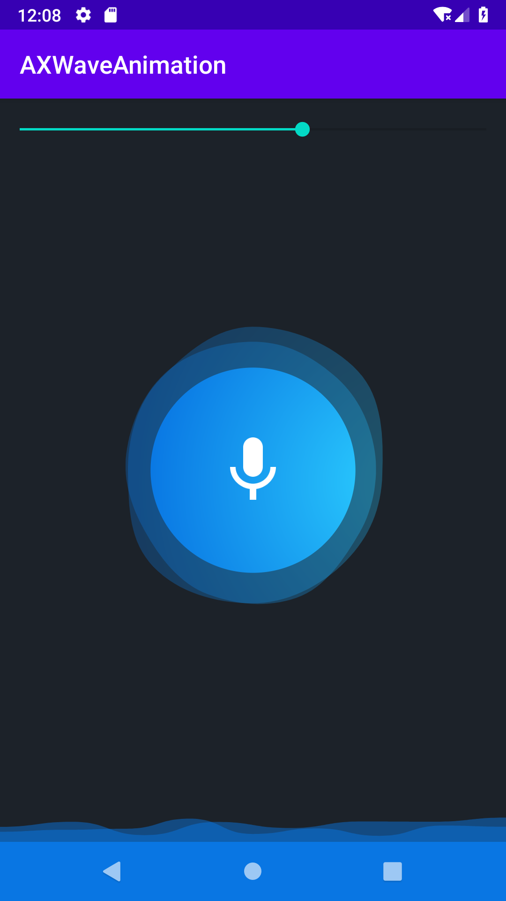

# AXWaveAnimation
 **AXWaveAnimation** is a wave animation or a Bubble animation for recording or playing audio using the **amplitude** of the voice

 


## Installation

AXWaveAnimation is available in the JCenter, so you just need to add it as a dependency (Module gradle)

Gradle
```gradle
implementation 'com.aghajari.waveanimation:AXWaveAnimation:1.0.0'
```

Maven
```xml
<dependency>
  <groupId>com.aghajari.waveanimation</groupId>
  <artifactId>AXWaveAnimation</artifactId>
  <version>1.0.0</version>
  <type>pom</type>
</dependency>
```

## Usage

Simple usage (using android layout) :

Circle AXWaveView :
```xml
<com.aghajari.waveanimation.AXWaveView
    android:id="@+id/wave"
    android:layout_width="250dp"
    android:layout_height="wrap_content"
    app:shader_color_1="#2BCEFF"
    app:shader_color_2="#0976E3"
    app:circle="true"
    app:amplitude="-1"/>
```

Linear AXLineWaveView :
```xml
<com.aghajari.waveanimation.AXLineWaveView
    android:id="@+id/wave"
    android:layout_width="match_parent"
    android:layout_height="48dp"
    app:shader_color_1="#2BCEFF"
    app:shader_color_2="#2BCEFF"
    app:main_wave="false"
    app:amplitude="-1"/>
```

Thats it!

You can change the amplitude of the view by using this code :
```java
AXWaveView waveView = findViewById(R.id.wave);
waveView.setAmplitude(AXWaveView.MAX_AMPLITUDE);
```

### AXWeavingState
You can save your wave states and switch bettwen them by using `setState(key)`

Example :

```java
waveView.addState(1, AXWeavingState.create(1,
          new RadialGradient(200,200,200, new int[]{0xff2BCEFF,0xff0976E3}
           ,null, Shader.TileMode.CLAMP)));

waveView.addState(2, new AXWeavingState(2){

    @Override
    protected void updateTargets() {
       targetX = 0.2f + 0.1f * random.nextInt(100) / 100f;
       targetY = 0.7f + 0.1f * random.nextInt(100) / 100f;
    }

    @Override
    public Shader createShader() {
       return new RadialGradient(200,200,200, new int[]{0xff12B522,0xff00D6C1}
                ,null, Shader.TileMode.CLAMP);
    }
});

waveView.setState(1);
```

Now you have saved 2 states with different wave colors,

Switch between states by clicking the view :
```java
waveView.setOnClickListener(new View.OnClickListener() {
     @Override
     public void onClick(View view) {
         if (waveView.getCurrentState().getState() == 1) {
           waveView.setState(2);
         } else {
           waveView.setState(1);
         }
    }
});
```

This is exactly what you are seeing in the gif preview.

You can also disable showing waves for a specific state by disabling `supportsWave` in the state

### AXWaveDrawable
You can customize the wave drawables or add or remove the wave drawables.

Example :
```java
waveView.removeWaveDrawable(1);
```

Output :


### Customization
Well, You can customize everything that you can imagine.
Such as Colors, Animation's Speed for each wave drawable,Max/Min Radius for each wave drawable, etc


## Author 
- **Amir Hossein Aghajari**

License
=======

    Copyright 2020 Amir Hossein Aghajari
    Licensed under the Apache License, Version 2.0 (the "License");
    you may not use this file except in compliance with the License.
    You may obtain a copy of the License at

       http://www.apache.org/licenses/LICENSE-2.0

    Unless required by applicable law or agreed to in writing, software
    distributed under the License is distributed on an "AS IS" BASIS,
    WITHOUT WARRANTIES OR CONDITIONS OF ANY KIND, either express or implied.
    See the License for the specific language governing permissions and
    limitations under the License.


<br><br>
<div align="center">
  
  <br><a>Amir Hossein Aghajari</a> • <a href="mailto:amirhossein.aghajari.82@gmail.com">Email</a> • <a href="https://github.com/Aghajari">GitHub</a>
</div>
